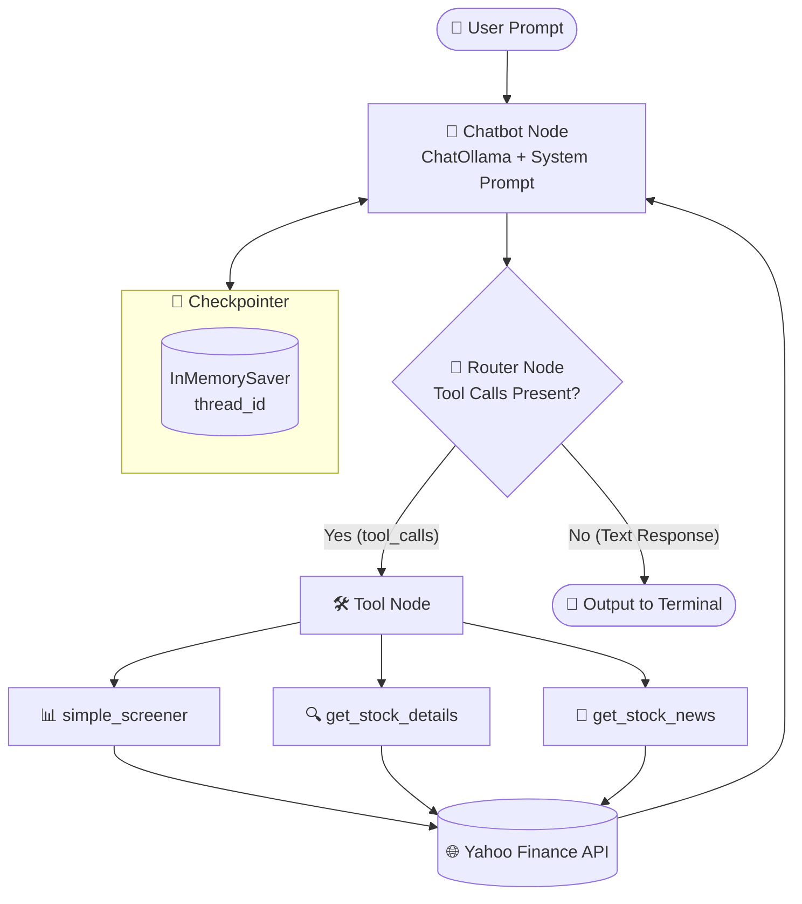

# 📈 LangGraph Stock Screener Agent

[](https://www.python.org/)
[](https://langchain-ai.github.io/langgraph/)
[](https://python.langchain.com/)
[](https://ollama.ai/)
[](https://docs.astral.sh/uv/)
[](https://finance.yahoo.com/)

An autonomous, conversational financial research and screening agent built with **LangGraph**, **LangChain**, local **Ollama** (e.g. `qwen2.5:14b`), and **Yahoo Finance** (`yfinance`). The agent translates natural language queries into structured market screener filters, drills down into specific stock fundamentals, retrieves breaking news, and synthesizes investment insights directly in your terminal.

---

## 📑 Table of Contents

- [Project Overview](#-project-overview)
- [Key Features](#-key-features)
- [Agent Tools](#-agent-tools)
- [System Architecture](#-system-architecture)
- [How It Works](#-how-it-works)
- [Supported Screener Categories](#-supported-screener-categories)
- [Tech Stack](#-tech-stack)
- [Project Structure](#-project-structure)
- [Installation & Setup](#-installation--setup)
- [Usage & Example Prompts](#-usage--example-prompts)
- [Interactive CLI Commands](#-interactive-cli-commands)
- [Configuration](#-configuration)
- [Troubleshooting](#-troubleshooting)
- [License](#-license)

---

## 🔍 Project Overview

Navigating financial markets typically requires bouncing between stock screeners, balance sheets, analyst recommendations, and news feeds.

This project provides a **ReAct-pattern agentic workflow** using **LangGraph**:
- **Understands financial intent:** Interprets queries such as *"What are today's top gainers?"*, *"Give me a deep dive on NVDA's valuation"*, or *"Find undervalued large caps and compare their PE ratios"*.
- **Multi-Tool Autonomous Execution:** Dynamically chooses between macro market screeners, single-ticker fundamental analysis, and breaking company news.
- **Synthesizes Market Intelligence:** Summarizes valuation metrics, PEG ratios, 52-week ranges, dividend yields, and consensus analyst targets into readable Markdown tables.
- **100% Local & Private:** Powered by local Ollama models with zero required external API keys.

---

## ✨ Key Features

- 🤖 **Local LLM Powered:** Compatible with `qwen2.5:14b`, `qwen2.5:7b`, `llama3.2`, or any Ollama-compatible model.
- 🔄 **Cyclic Graph Architecture:** Built using LangGraph `StateGraph` with custom conditional edge routing (`router_node`) and `ToolNode`.
- 🛠️ **Expanded Toolset:**
  - `simple_screener`: Macro screening across 15+ predefined market categories.
  - `get_stock_details`: Comprehensive fundamental indicators (P/E, Market Cap, 52w Range, Target Price, Business Summary).
  - `get_stock_news`: Real-time news stories and catalysts for any ticker.
- 💾 **Stateful Checkpointing:** In-memory checkpointing (`InMemorySaver`) for multi-turn conversational memory.
- 💬 **Interactive CLI:** Color-coded terminal UI with `/help`, `/clear`, and `/model` commands.
- 🛡️ **Defensive Error Handling:** Input validation, parameter defaults, and graceful error catching for network/API limits.

---

## 🛠️ Agent Tools

| Tool | Purpose | Key Inputs |
| :--- | :--- | :--- |
| `simple_screener` | Screens market by macro criteria | `screen_type`, `offset`, `count` |
| `get_stock_details` | Retrieves deep company fundamentals & valuation | `symbol` (e.g. `AAPL`, `NVDA`) |
| `get_stock_news` | Fetches recent headlines and catalysts | `symbol`, `max_articles` |

---

## 🏗️ System Architecture



---

## 📋 Supported Screener Categories

The `simple_screener` tool supports the following categories:

| Category Key | Asset Type | Description |
| :--- | :--- | :--- |
| `day_gainers` | Stocks | Top percentage price gainers for the current trading day |
| `day_losers` | Stocks | Largest percentage decliners for the day |
| `most_actives` | Stocks | Equities with highest trading volume |
| `most_shorted_stocks` | Stocks | Stocks with high short interest |
| `growth_technology_stocks`| Stocks | Tech sector companies exhibiting high growth |
| `undervalued_growth_stocks`| Stocks | Growth stocks trading at attractive valuation multiples |
| `undervalued_large_caps` | Stocks | Large-cap companies trading below historical valuations |
| `aggressive_small_caps` | Stocks | High-beta small capitalization equities |
| `small_cap_gainers` | Stocks | Small-cap stocks with high momentum |
| `top_mutual_funds` | Mutual Funds | Top-rated mutual funds by performance |
| `solid_large_growth_funds`| Funds | Large-cap growth mutual funds and ETFs |
| `solid_midcap_growth_funds`| Funds | Mid-cap growth funds |
| `conservative_foreign_funds`| Funds | Defensive international funds |
| `high_yield_bond` | Bonds | Corporate and high-yield fixed-income assets |
| `portfolio_anchors` | Diversified | Foundational core holdings for balanced portfolios |

---

## 🚀 Installation & Setup

### Prerequisites

1. **Python 3.13+**
2. **[uv](https://docs.astral.sh/uv/)** package manager:
   ```bash
   pip install uv
   ```
3. **[Ollama](https://ollama.ai/)** running locally.

---

### Step 1: Install Dependencies

```bash
uv sync
```

### Step 2: Pull the Model

```bash
ollama pull qwen2.5:14b
```
*(Or use a lighter model like `qwen2.5:7b` or `llama3.2`)*

---

## 🎮 Usage & Example Prompts

Start the interactive terminal session:

```bash
uv run flow.py
```

### Example Prompts:
- *"Show me today's top 5 day gainers and summarize them in a table."*
- *"Find undervalued large caps and compare their P/E ratios."*
- *"Give me a deep valuation analysis and target price for NVDA."*
- *"What is the latest news affecting Tesla (TSLA)?"*
- *"Screen growth tech stocks, then provide details on the top candidate."*

---

## 💻 Interactive CLI Commands

Inside the agent session, you can run:
- `/help` - View available commands and example prompts.
- `/clear` - Reset conversation history and start a fresh session thread.
- `/model` - Display currently active model and Ollama endpoint.
- `exit` or `quit` - Terminate the session.

---

## ⚙️ Configuration

You can customize the model and Ollama endpoint using environment variables:

```bash
# Windows (PowerShell)
$env:OLLAMA_MODEL = "qwen2.5:7b"
$env:OLLAMA_BASE_URL = "http://localhost:11434"
uv run flow.py
```

---

## 📄 License

Open-source under MIT / Apache-2.0 license.

