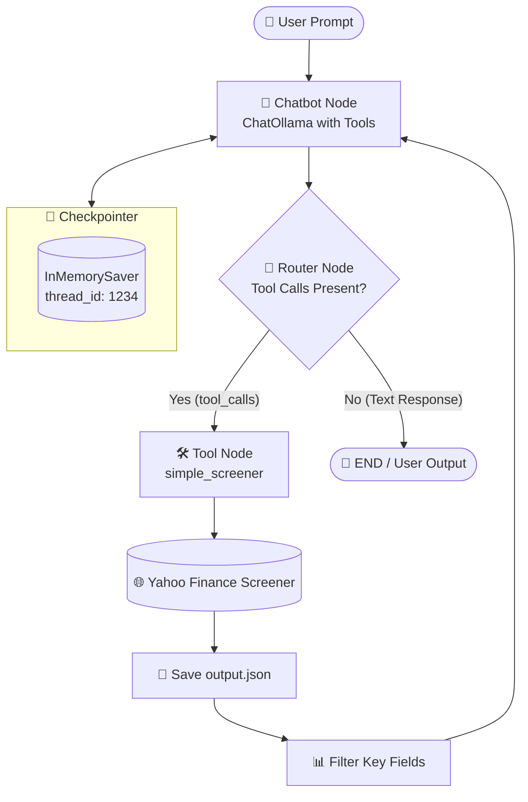

# 📈 LangGraph Stock Screener Agent

[](https://www.python.org/)
[](https://langchain-ai.github.io/langgraph/)
[](https://python.langchain.com/)
[](https://ollama.ai/)
[](https://docs.astral.sh/uv/)
[](https://finance.yahoo.com/)

An autonomous, conversational financial screener agent built with **LangGraph**, **LangChain**, local **Ollama** (`qwen2.5:14b`), and **Yahoo Finance** (`yfinance`). The agent translates natural language queries into structured market screener filters, retrieves real-time asset data, and formats comprehensive investment insights directly in your terminal.

---

## 📑 Table of Contents

- [Project Overview](#-project-overview)
- [Key Features](#-key-features)
- [System Architecture](#-system-architecture)
- [How It Works](#-how-it-works)
- [Supported Screener Categories](#-supported-screener-categories)
- [Tech Stack](#-tech-stack)
- [Project Structure](#-project-structure)
- [Installation & Setup](#-installation--setup)
- [Usage & Example Prompts](#-usage--example-prompts)
- [Output Data Schema](#-output-data-schema)
- [Technical Implementation Details](#-technical-implementation-details)
- [Troubleshooting](#-troubleshooting)
- [Future Improvements](#-future-improvements)
- [License](#-license)

---

## 🔍 Project Overview

Navigating stock market screeners usually requires manual configuration of multiple quantitative filters across different interfaces. 

This project provides a **ReAct-pattern agentic workflow** using **LangGraph**:
- **Understands financial intent:** Interprets queries such as *"What are today's top gainers?"* or *"Find me undervalued large cap stocks with high ratings"*.
- **Autonomous Tool Execution:** Automatically selects the appropriate screener criteria and queries the Yahoo Finance Screener API.
- **Synthesizes Market Intelligence:** Filters raw quote data down to vital metrics (52-week highs/lows, analyst ratings, dividend yields, bid/ask spreads) and returns structured analysis.
- **Local & Private Execution:** Runs locally with Ollama, requiring zero paid external LLM API keys.

---

## ✨ Key Features

- 🤖 **Local LLM Powered:** Uses `qwen2.5:14b` running locally via Ollama for tool calling and natural language reasoning.
- 🔄 **Cyclic Graph Architecture:** Built using LangGraph `StateGraph` with custom conditional edge routing (`router`) and `ToolNode`.
- 📊 **Comprehensive Asset Coverage:** Screens across 15+ predefined Yahoo Finance categories covering equities, mutual funds, bond funds, and growth assets.
- 💾 **Stateful Memory & Checkpointing:** Incorporates `InMemorySaver` checkpointer with thread ID persistence to preserve conversational context across multi-turn chats.
- 📁 **JSON Data Export:** Automatically serializes full screener payloads into [`output.json`](output.json) for inspection and offline analysis.
- 🎨 **Enhanced CLI Experience:** Color-coded terminal interface with interactive prompt loops and progress indicators.

---

## 🏗️ System Architecture



---

## 🔄 How It Works

1. **User Input:** The user submits a natural-language financial query via the CLI.
2. **LLM Node (`chatbot`):** The `ChatOllama` model receives the conversation history. If it determines stock screener criteria match the request, it outputs a structured tool call.
3. **Router (`router`):**
   - If `tool_calls` are detected: Routes execution to the `tools` node.
   - If no tool calls are needed: Routes execution to `END`.
4. **Tool Execution (`simple_screener`):**
   - Maps the intent to `yf.PREDEFINED_SCREENER_QUERIES[screen_type]`.
   - Fetches live quotes with pagination (`offset`) and batch size.
   - Saves raw response to [`output.json`](output.json).
   - Extracts vital financial indicators (`symbol`, `shortName`, `bid`, `ask`, `averageAnalystRating`, `fiftyTwoWeekHigh`, `fiftyTwoWeekLow`, `dividendYield`, `exchange`).
5. **Synthesis:** The filtered market data returns to the `chatbot` node via a `ToolMessage`. The LLM synthesizes the numbers and presents an investment summary.

---

## 📋 Supported Screener Categories

The [`tool.py`](tool.py) module supports the following Yahoo Finance screener query types:

| Category Key | Asset Type | Description |
| :--- | :--- | :--- |
| `day_gainers` | Stocks | Top percentage price gainers for the current trading day |
| `day_losers` | Stocks | Largest percentage decliners for the day |
| `most_actives` | Stocks | Equities with highest trading volume |
| `most_shorted_stocks` | Stocks | Stocks with the highest short interest percentage |
| `growth_technology_stocks`| Stocks | Tech sector companies exhibiting high revenue/earnings growth |
| `undervalued_growth_stocks`| Stocks | Growth stocks trading at attractive valuation multiples |
| `undervalued_large_caps` | Stocks | High-market-cap companies trading below historical valuations |
| `aggressive_small_caps` | Stocks | High-beta small capitalization equities |
| `small_cap_gainers` | Stocks | Small-cap stocks with high momentum |
| `top_mutual_funds` | Mutual Funds | Top-rated mutual funds by performance |
| `solid_large_growth_funds`| Funds | Large-cap growth mutual funds and ETFs |
| `solid_midcap_growth_funds`| Funds | Mid-cap growth funds |
| `conservative_foreign_funds`| Funds | International funds with defensive allocation |
| `high_yield_bond` | Bonds | Corporate and high-yield fixed-income assets |
| `portfolio_anchors` | Diversified | Foundational core holdings for balanced portfolios |

---

## 💻 Tech Stack

### Core AI & Agent Framework
- **[LangGraph](https://github.com/langchain-ai/langgraph):** State machine, graph compilation, cyclic graph execution, and memory checkpointers.
- **[LangChain Core](https://github.com/langchain-ai/langchain):** Tool definitions (`@tool`), message schema (`HumanMessage`, `AIMessage`, `ToolMessage`).
- **[LangChain Ollama](https://github.com/langchain-ai/langchain-ollama):** Native Ollama integration for local inference and tool binding.

### Financial Data & Utilities
- **[yfinance](https://github.com/ranaroussi/yfinance):** Live market screener data extraction from Yahoo Finance.
- **[Colorama](https://pypi.org/project/colorama/):** Terminal color styling and visual status formatting.

### Runtime & Build
- **Python 3.13:** Modern Python execution runtime.
- **[uv](https://docs.astral.sh/uv/):** Blazing fast Python package resolver and virtual environment manager.
- **Setuptools / Wheel:** Packaging and module distribution backend.

---

## 📂 Project Structure

```text
├── .gitignore              # Ignored files, cache directories, and virtual environments
├── .python-version         # Python version lock file (3.13)
├── flow.py                 # Core LangGraph graph definition, nodes, router & main CLI loop
├── output.json             # Live screener query result dump (generated at runtime)
├── pyproject.toml          # Project configuration, build metadata & dependencies
├── README.md               # Project documentation
├── tool.py                 # Screener tool definition interfacing with yfinance
├── toolhelpers.txt         # Reference docstrings and screener category cheat-sheet
└── uv.lock                 # Deterministic dependency lockfile
```

---

## 🚀 Installation & Setup

### Prerequisites

1. **Python 3.13+** installed on your system.
2. **[uv](https://docs.astral.sh/uv/)** installed:
   ```bash
   pip install uv
   ```
3. **[Ollama](https://ollama.ai/)** installed and running.

---

### Step 1: Clone the Repository

```bash
git clone https://github.com/your-username/langgraph-stock-screener.git
cd langgraph-stock-screener
```

### Step 2: Install Dependencies

Use `uv` to automatically create a virtual environment and install all dependencies:

```bash
uv sync
```
*(Or `python -m uv sync`)*

### Step 3: Pull the Ollama Model

Make sure Ollama is running, then pull the default model:

```bash
ollama pull qwen2.5:14b
```

> 💡 **Hardware Tip:** If you have limited VRAM or RAM (under 16 GB), you can pull a lighter model such as `qwen2.5:7b` or `llama3.2`:
> ```bash
> ollama pull qwen2.5:7b
> ```
> Then update the model parameter on line 11 of [`flow.py`](flow.py#L11):
> ```python
> llm = ChatOllama(model='qwen2.5:7b')
> ```

---

## 🎮 Usage & Example Prompts

Start the interactive terminal session:

```bash
uv run flow.py
```
*(Or `python -m uv run flow.py`)*

### Example Prompts to Try:

```text
🤖 Pass your prompt here: Show me today's top day gainers
```
```text
🤖 Pass your prompt here: Find undervalued large cap stocks with their analyst ratings
```
```text
🤖 Pass your prompt here: What are some high-yield bond options available right now?
```
```text
🤖 Pass your prompt here: Give me solid midcap growth funds for a long-term portfolio
```

Type `exit`, `quit`, or `q` to exit the application.

---

## 📊 Output Data Schema

When the agent queries Yahoo Finance, each quote item is filtered down to the following core attributes:

```json
{
  "symbol": "ZM",
  "shortName": "Zoom Communications, Inc.",
  "exchange": "NMS",
  "bid": 92.63,
  "ask": 109.55,
  "fiftyTwoWeekHigh": 114.74,
  "fiftyTwoWeekLow": 70.7,
  "averageAnalystRating": "1.9 - Buy",
  "dividendYield": 0.0
}
```

Full unfiltered query responses are also saved locally to [`output.json`](output.json) after each tool call for auditability.

---

## ⚙️ Technical Implementation Details

<details>
<summary><b>1. LangGraph State Management</b></summary>

The state graph is configured with an annotated list reducer `add_messages`:

```python
class State(dict): 
    messages: Annotated[list, add_messages]
```
This ensures new messages (User, AI, Tool) are appended cleanly to conversation history rather than overwriting existing state.
</details>

<details>
<summary><b>2. Dynamic Tool Binding & Routing</b></summary>

Tools are bound directly to the chat model using `llm.bind_tools(tools)`. The custom router dynamically checks the message's `tool_calls` attribute:

```python
def router(state: State): 
    last_message = state['messages'][-1]
    if hasattr(last_message, 'tool_calls') and last_message.tool_calls: 
        return "tools" 
    else: 
        return END 
```
</details>

<details>
<summary><b>3. Persistent Thread Checkpointing</b></summary>

State is persisted across the invocation loop using `InMemorySaver`:

```python
memory = InMemorySaver()
graph = graph_builder.compile(checkpointer=memory)

result = graph.invoke(
    {"messages": [{"role": "user", "content": prompt}]}, 
    config={"configurable": {"thread_id": "1234"}}
)
```
This enables contextual follow-up questions within the same execution session.
</details>

---

## 🛠️ Troubleshooting

<details>
<summary><b>Error: <code>model 'qwen2.5:14b' not found (status code: 404)</code></b></summary>

- **Cause:** Ollama is running, but the specified model has not been downloaded.
- **Fix:** Run `ollama pull qwen2.5:14b` in your terminal.
</details>

<details>
<summary><b>Error: <code>ollama : The term 'ollama' is not recognized</code></b></summary>

- **Cause:** Ollama was installed during an open terminal session and PATH has not refreshed.
- **Fix:** Restart your terminal window, or run directly via:
  ```powershell
  & "$env:LOCALAPPDATA\Programs\Ollama\ollama.exe" pull qwen2.5:14b
  ```
</details>

<details>
<summary><b>Error: <code>Multiple top-level modules discovered in a flat-layout</code></b></summary>

- **Cause:** Setuptools requires explicit module declarations when `flow.py` and `tool.py` reside at the root level.
- **Fix:** Ensure [`pyproject.toml`](pyproject.toml) includes `[tool.setuptools] py-modules = ["flow", "tool"]`.
</details>

---

## 🔮 Future Improvements

- [ ] **Streamlit / Web UI:** Add a visual dashboard for interactive charting of screener outputs.
- [ ] **Streaming Responses:** Enable real-time token streaming from LangGraph (`graph.stream`).
- [ ] **Multi-Tool Expansion:** Add technical analysis indicators (RSI, MACD, SMA) and company news summary tools.
- [ ] **Persistent Database Checkpointer:** Integrate SQLite (`SqliteSaver`) or PostgreSQL for permanent session persistence across restarts.

---

## 📄 License

This project is open-source. Feel free to modify and expand upon it for personal and educational use.

